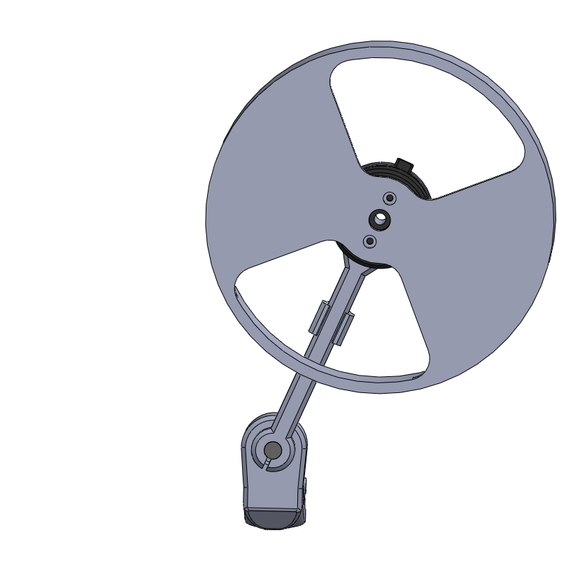

# Arduino field oriented control (FOC) reaction wheel inverted pendulum  

This is a project of designing and controlling the reaction wheel inverted pendulum based entirely on Arduino SimpleFOC library and SimpleFOC shield. 

