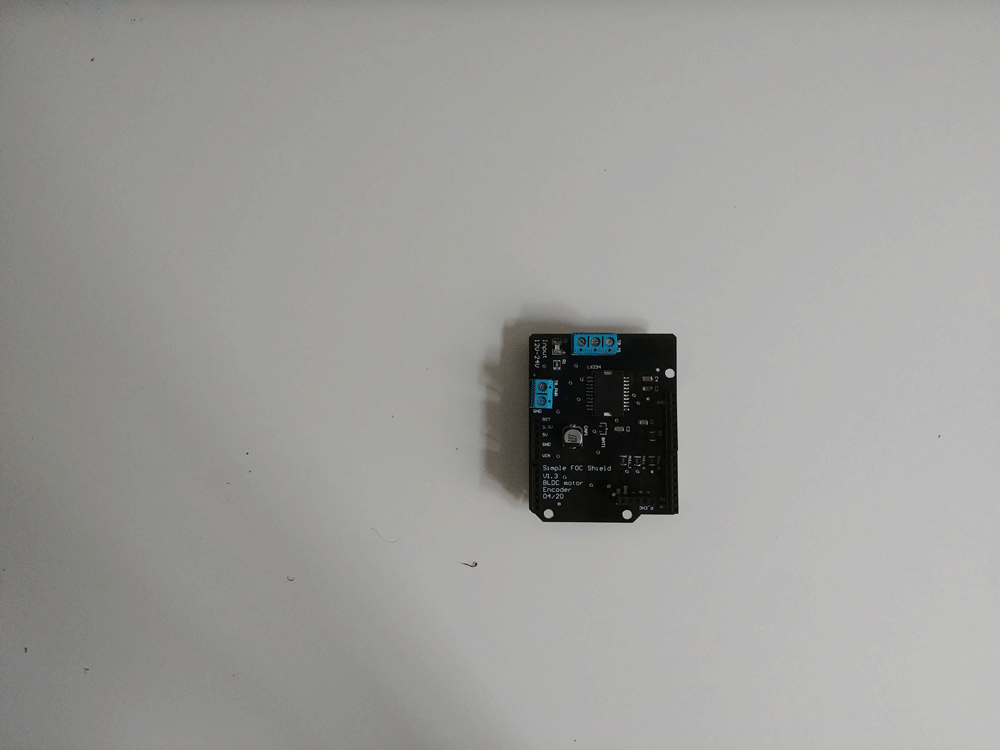
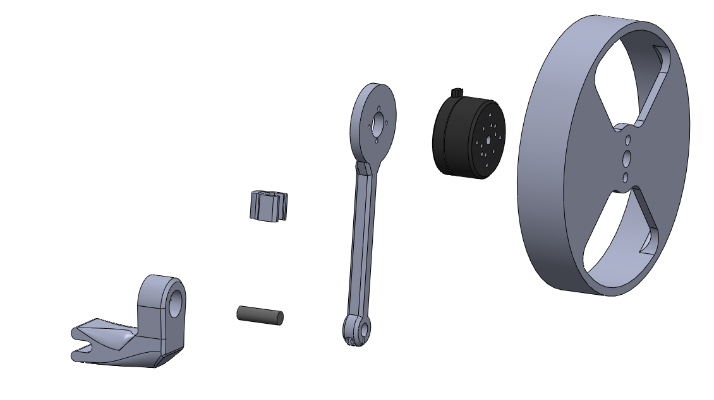
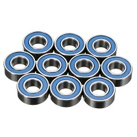
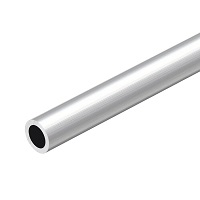
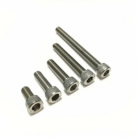
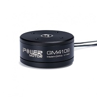
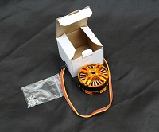
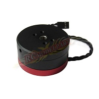
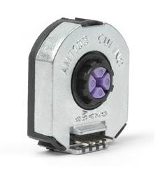
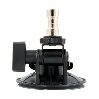

# Arduino field oriented control (FOC) reaction wheel inverted pendulum  

This is a project of designing and controlling the reaction wheel inverted pendulum based entirely on Arduino [SimpleFOC library and SimpleFOC shield](https://github.com/askuric/Arduino-FOC). 

    
    

This is a very fun project in many ways, but for me the most exciting part was the ability to use the Field Oriented Control algorithm. 
**The main benefits of using the BLDC motor in this project was:**
-  High torque to weight ratio
   - The lighter the better
-  Lots of torque for low angular velocities
   - No need to spin the motor to very high PRM to achieve high torques
-  No gearboxes and backlash
   - Very smooth operation = very stable pendulum

So far, FOC has been restricted to high-end applications due to the complexity and the cost of the hardware mostly, but also due to the lack of user-friendly, well documented software. Therefore I am very happy to show you the projects like this one, which directly benefit the FOC algorithm and BLDC motors and encourage you to use these techniques in your projects as well. One of the very simple ways of starting (demonstrated in this video) is using the [SimpleFOC library and SimpleFOC shield](https://github.com/askuric/Arduino-FOC). 

# What are the necessary components?
Due to the using of the brushless motor and the SimpleFOC shield, this might be one of the simplest hardware setups of the reaction wheel inverted pendulum there is.

    
    

## 3D printed parts
This pendulum project has three 3d printed parts. You can find them in the `CAD files > STL` directory. They are:
- inertia wheel (`reaction_wheel.stl`)
    - infill: `70%`
    - layer hight: `<0.12mm`
    - it should be printed as precise as possible (to reduce the vibrations)
    - mass: `100g`
- pendulum arm (`pendulum_arm.stl`) 
    - infill: `50-70%`
    - layer hight: `0.12-0.2mm`
    - no need for too much precision, only the strength
    - mass: `20g`
- base (`bottpm_swingup.stl`)
    - infill: `70%`
    - layer hight: `<0.12`
    - due to the bearings needs to be pretty precise
    - mass: `60g`
- cable holder (`cable_holder.stl`) - *optional*

I have printed the pendulum in the PETG filament but there should be no real difference in using PLA or ABS filaments, this is just what I had in hand at the moment.

You will also find all the CAD files used in this project in the `CAD files` folder. I have included the Solidworks 2016 parts and the full assembly. Additionally all the parts are exported to STEP format for easier porting to the other CAD IDEs.

> Beware: 
I have designed hte holes on the pendulum arm and the wheel to match perfectly the motor the encoders I was using, so please check the dimensions of your motors and encoder holes before printing :D

If you would prefer some other CAD format, let me know, maybe I can export it differently. 

## Hardware parts
All of the mechanical hardware is very simple and can be bought in any hardware store. If you prefer to buy it online, I have included links to the Ebay products you could use. 

Component | Description | Link | Price
---- | ---- | ---- | ----
 | Ball bearing   8x16x5mm   3x | [Ebay](https://www.ebay.com/itm/608-623-625-688zz-Double-sided-Metal-Sealed-Deep-Groove-Ball-Bearing-High-Speed/223959673454?hash=item3425096a6e:m:mP1kq1bn9gGwE3T_vvNPXaA) | 3$
 | Aluminum tube   diameter: 8mm    length: 30mm | [Ebay](https://www.ebay.com/itm/Aluminum-Tube-in-various-diam-and-many-lengths/122904111733?hash=item1c9da7ea75:m:mv3bktoI7tBDQ8xDbciZK6A) | 3$
 |M3 screws  7pcs   M3x10mm | [Ebay](https://www.ebay.com/itm/M2-M2-5-M3-M4-M5-M6-M8-Stainless-Steel-Metric-Hex-Socket-Head-Cap-Screws-Bolt/123439613021?hash=item1cbd93045d:m:mQsuAChkph7G_5vk5ctmQiA) | 2$
 | M4 screws & nuts  2pcs   M4x50mm | [Ebay](https://www.ebay.com/itm/M2-M2-5-M3-M4-M5-M6-M8-Stainless-Steel-Metric-Hex-Socket-Head-Cap-Screws-Bolt/123439613021?hash=item1cbd93045d:m:mQsuAChkph7G_5vk5ctmQiA) | 4$

## Electrical components
### BLDC motor
Unfortunately the BLDC motor I was using in my video is an old version of the [iPower GM4108](https://shop.iflight-rc.com/index.php?route=product/product&product_id=217&search=GM4108H-120T) motor which is not available anymore to buy, in any case I was not able to find a website that would sell them. 
The good news is that you can use basically any other gimbal motor in that class with only minor modifications, mostly in the CAD parts - change the mounting holes positions. Some of the motors I was able to find that would be the most similar to my motor would be:
Component | Description | Link | Price
---- | ---- | ---- | ----
 | iPower Motor GM4108H-120T | [iFlight webshop](https://shop.iflight-rc.com/index.php?route=product/product&product_id=217&search=GM4108H-120T) | 35$
 | BGM 4108 120T | [Ebay](https://www.ebay.com/itm/gimbal-brushless-motor-BGM-4108-120T-hollow-silver-version/261539739163?hash=item3ce4fbb61b:g:4iAAAOSwPe1Tzdhy) | 30$
 | BGM4108-150HS | [Ebay](https://www.ebay.com/itm/New-Brushless-Gimbal-Motor-BGM4108-150HS-24N22P-for-Sony-NEX5-7-Camera-Mount-DIY/261903969970?epid=1539061157&hash=item3cfab16eb2:g:0EIAAOSwiLdWBLrX) | 32$

### Position sensors
In this project I am using two encoders to track the movement of the pendulum and the motor. Now, this is somewhat particular to my implementation, there are may ways to measure the angle of the pendulum. You could use the `IMU` and measure the inclination by combining the accelerometer and the gyro measurement, you could also use the magnetic sensors such as `AS5048` and similar absolute encoders. 

The encoders I have used in this project are:
 | AMT103 CUI | [Mouser](https://eu.mouser.com/ProductDetail/CUI-Devices/AMT103-V?qs=WyjlAZoYn51X2GCrrvGQTg==T) | 20$
---- | ---- | ---- | ----

The main features these encoders are:
 - Configurable number of impulses per revolution (PPR)
    - `48 - 2048`
 - Vey easy mounting
    - click-on to any type of shaft ` < 8mm`
 - Integrated pull-ups 
 - Index pin
 - Low-cost `~20$`

## BLDC driver
In this project I used the [SimpleFOCShield board](https://askuric.github.io/Arduino-FOC/arduino_simplefoc_shield_showcase) which is basically an Arduino shield which enables the usage of the FOC algorithm with the BLDC motors. It is practically plug & play in combination with the Arduino [SimpleFOC library](https://askuric.github.io/Ard.uino-FOC/arduino_simplefoc_library_showcase).

There are quiet a few boards out there that are in short a triple H-bridge motor drivers and the SimpleFOC library will be compatible with most of them. But for most of them the hardware setup will be a bit more complex. Here are some examples of the possible BLDC drives you could use:
Examples | Description | Link | Price
---- | ---- | ---- | ---
| Arduino SimpleFOCShield | [More info](https://askuric.github.io/simplefoc_shield_product) | 25$
 | Dorotek L6234 breakout board| [Drotek](https://store-drotek.com/212-brushless-gimbal-controller-l6234.html), [Ebay](https://www.ebay.fr/itm/L6234-Breakout-Board-/153204519965) | 30$
 | HMBGC V2.2 | [Ebay](https://www.ebay.com/itm/HMBGC-V2-0-3-Axle-Gimbal-Controller-Control-Plate-Board-Module-with-Sensor/351497840990?hash=item51d6e7695e:g:BAsAAOSw0QFXBxrZ:rk:1:pf:1) | 20$

## Table mount
There are surely many ways to mount this pendulum to the stable surface, in my case I hade on my hands a very robust vacuum suction cup holder which works perfectly for this application. It is not the cheapest solution though.
 | Delkin Fat Gecko | [Ebay](https://www.ebay.com/itm/Delkin-Fat-Gecko-Stealth-Vacuum-Light-Mount-Holds-4-LB-Free-US-Shipping/141019370583?hash=item20d568d457:g:O6wAAMXQXMRR6EZ7) | 30$
---- | ---- | ---- | ----

The only important thing is that the pendulum base is fixed, everything else is the design choice :D 